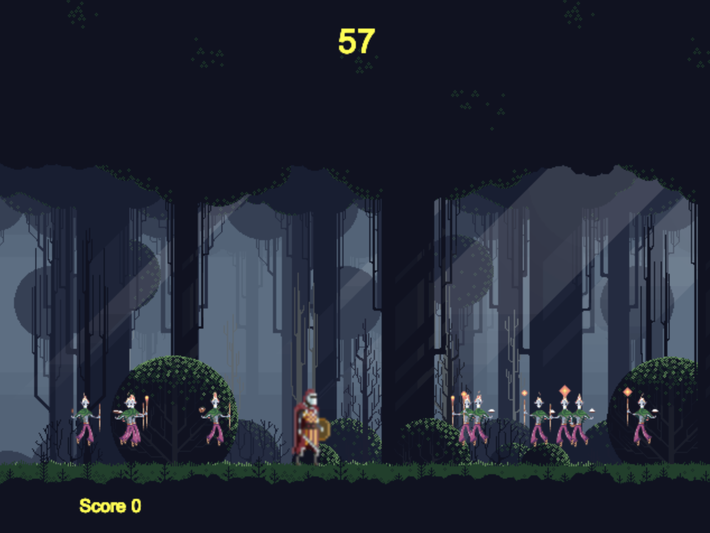

# The Knight 

### [Live here](https://heimanchan.github.io/The-Knight/)


## Overview
The Knight is a simple 2D game to play and pick up. In the game, you control the character and must survive 60 seconds. Enemies will be running from the left to the right of the game view and vice versa. If you hit an enemy you lose. The player can either dodge the enemy or kill them by hitting the attack button. Every enemy kill is one score, so try to kill as many as possible. The speed and the amount of enemies will be increased by the time goes so try your best to survive!

## Functionality
* Players can move the character to the left or right as well as jumping on a surface
* Players can perform an attack by pressing a button
* Enemies are spawned from the left or right of the game view and run to the opposite direction
* Enemies can be killed by the attack of the character and the player get one score
* The game ends if the character hits an enemy or the player survives 60 seconds

## Technologies employed
* Vanilla JavaScript for overall structure and game logic
* HTML5 Canvas for rendering
* HTML5 Audio for background music and sound effect
* Webpack to bundle and serve up the various scripts

## Code snippet
The following algorithm generates enemies every 7 seconds with random speeds of a certain range in the game loop.
```js
if (parseInt((now / 1000) + 20) % 7 === 0) {
  //                                  (random * max - min + 1) + min
  enemies.push(new Enemy(Math.floor((Math.random() * 7 - 2 + 1) + 3)));
}
```
## Bonus features (in the future)
* Moving obstacles will be generated from different directions
* Rolling stones from left or right
* Fireballs from the sky
* Boss
* Enemies will follow the character until they are being killed